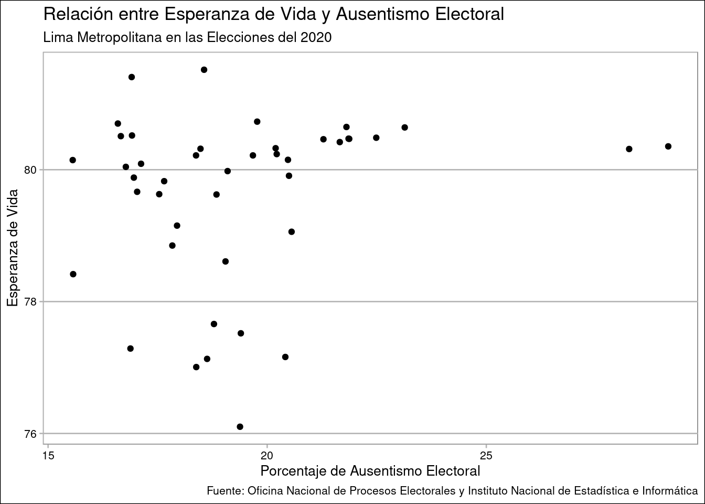
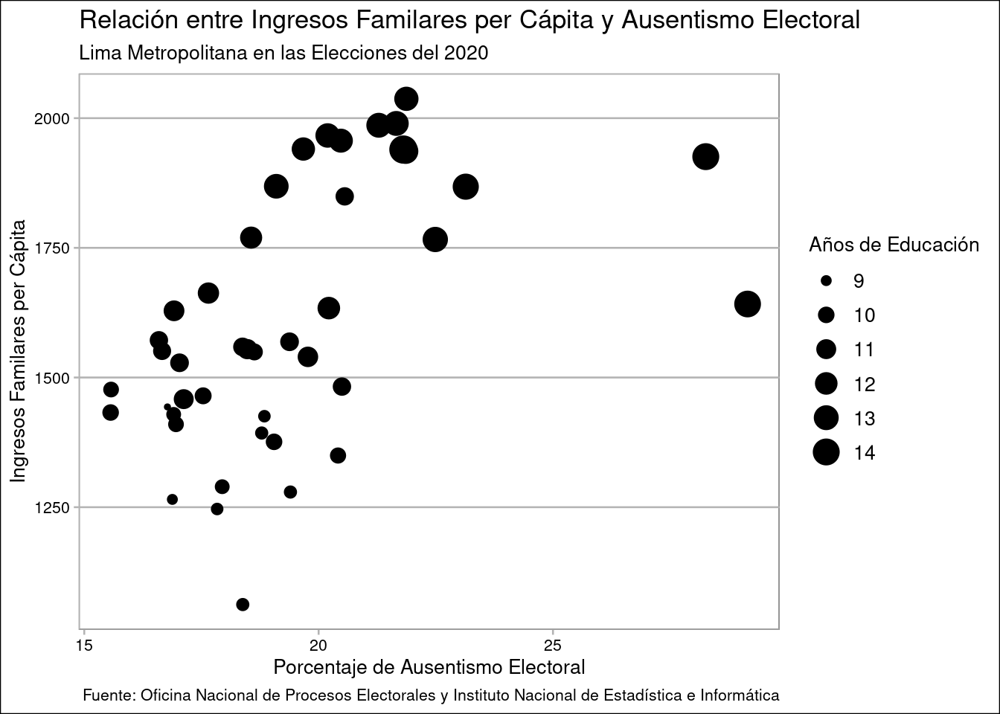

# Ausentismo en las Elecciones Congresales 2020


```r
library(ggthemes)
library(tidyverse)
```

```
## ── Attaching packages ─────────────────────────────────────── tidyverse 1.3.0 ──
```

```
## ✓ ggplot2 3.3.3     ✓ purrr   0.3.4
## ✓ tibble  3.1.0     ✓ dplyr   1.0.3
## ✓ tidyr   1.1.2     ✓ stringr 1.4.0
## ✓ readr   1.4.0     ✓ forcats 0.5.0
```

```
## ── Conflicts ────────────────────────────────────────── tidyverse_conflicts() ──
## x dplyr::filter() masks stats::filter()
## x dplyr::lag()    masks stats::lag()
```

El ausentismo electoral ha sido un lastre a lo largo de los últimos 20 años de democracia, a nivel nacional y subnacional, dificilmente superando el 30% de votantes pero nunca debajo del 15%. Con ello, nos encontramos con la necesidad entender que puede incentivar dicha actitud, lo cual suele atribuirse al desinterés o la desafección hacia el sistema político o la política en sentido general.


@almond1970 habían planteado el concepto de eficacia política para referirse a la autopercepción de capacidad influencia que una persona tiene sobre el sistema político y en su vida cotidiana. Esto, a su vez, fue vinculado con el nivel socioeconómico y, además, con el interés en la política (y el nivel educativo era un buen predictor de ello). Fernández (2019) va más lejos al vincular la precariedad a nivel de satisfacción de necesidades con la apatía política y el apoyo a partidos populistas de derecha, situando el caso Europeo y la reducción del estado de bienestar.

Contando con la información brindada por la Oficina Nacional de Procesos Electorales y el Instituto Nacional de Estadística e Informática, intentaré establecer una relación entre los años de educación superior, la esperanza de vida, los ingresos familiares per capita y el IDH de los 43 distritos de Lima al vincularse al ausentismo electoral. 

Consciente de las grandes limitaciones en materia de información disponible, el análisis presentado servirá más de referencia sobre la interrelación entre la satisfacción de necesidades y la actitud hacia el sistema política.


```r
metadata <- read_csv("data/metadata.csv")
idhdistrito <- read_csv("data/idhdistrito.csv")
```

## El Ausentismo Electoral en las Elecciones del 2020

En las Elecciones Congresales del 2020, el ausentismo estuvo distribuido a lo largo de todas las circunscripciones. Para esto utilizo la base de datos metadata, la cual contiene información de la Oficina Nacional de Procesos Electorales sobre la participación electoral a nivel nacional.


```r
metadata %>% 
  sample_n(10) 
```

<div style="border: 1px solid #ddd; padding: 0px; overflow-y: scroll; height:600px; overflow-x: scroll; width:100%; "><table class="table table-striped table-hover table-condensed table-responsive" style="margin-left: auto; margin-right: auto;">
<caption>(\#tab:antenor1kable)Muestra de 10 observaciones al azar de metadata</caption>
 <thead>
  <tr>
   <th style="text-align:left;position: sticky; top:0; background-color: #FFFFFF;"> num_acta </th>
   <th style="text-align:left;position: sticky; top:0; background-color: #FFFFFF;"> CCODI_UBIGEO </th>
   <th style="text-align:left;position: sticky; top:0; background-color: #FFFFFF;"> TNOMB_LOCAL </th>
   <th style="text-align:left;position: sticky; top:0; background-color: #FFFFFF;"> TDIRE_LOCAL </th>
   <th style="text-align:left;position: sticky; top:0; background-color: #FFFFFF;"> CCENT_COMPU </th>
   <th style="text-align:left;position: sticky; top:0; background-color: #FFFFFF;"> DEPARTAMENTO </th>
   <th style="text-align:left;position: sticky; top:0; background-color: #FFFFFF;"> PROVINCIA </th>
   <th style="text-align:left;position: sticky; top:0; background-color: #FFFFFF;"> DISTRITO </th>
   <th style="text-align:left;position: sticky; top:0; background-color: #FFFFFF;"> CCOPIA_ACTA </th>
   <th style="text-align:right;position: sticky; top:0; background-color: #FFFFFF;"> NNUME_HABILM </th>
   <th style="text-align:left;position: sticky; top:0; background-color: #FFFFFF;"> OBSERVACION </th>
   <th style="text-align:left;position: sticky; top:0; background-color: #FFFFFF;"> OBSERVACION_TXT </th>
   <th style="text-align:right;position: sticky; top:0; background-color: #FFFFFF;"> N_CANDIDATOS </th>
   <th style="text-align:right;position: sticky; top:0; background-color: #FFFFFF;"> TOT_CIUDADANOS_VOTARON </th>
  </tr>
 </thead>
<tbody>
  <tr>
   <td style="text-align:left;"> 028502 </td>
   <td style="text-align:left;"> 120508 </td>
   <td style="text-align:left;"> IE 80412 SAN JOSE </td>
   <td style="text-align:left;"> CALLE SAN JOSE 1090 </td>
   <td style="text-align:left;"> C40027 </td>
   <td style="text-align:left;"> LA LIBERTAD </td>
   <td style="text-align:left;"> PACASMAYO </td>
   <td style="text-align:left;"> SAN JOSE </td>
   <td style="text-align:left;"> 22N </td>
   <td style="text-align:right;"> 290 </td>
   <td style="text-align:left;"> CONTABILIZADAS NORMALES </td>
   <td style="text-align:left;"> ACTA ELECTORAL NORMAL </td>
   <td style="text-align:right;"> 7 </td>
   <td style="text-align:right;"> 231 </td>
  </tr>
  <tr>
   <td style="text-align:left;"> 025116 </td>
   <td style="text-align:left;"> 120101 </td>
   <td style="text-align:left;"> CENTRO PRE UNIVERSITARIO - CEPUNT </td>
   <td style="text-align:left;"> AV. AMERICA OESTE SN </td>
   <td style="text-align:left;"> C40029 </td>
   <td style="text-align:left;"> LA LIBERTAD </td>
   <td style="text-align:left;"> TRUJILLO </td>
   <td style="text-align:left;"> TRUJILLO </td>
   <td style="text-align:left;"> 23I </td>
   <td style="text-align:right;"> 295 </td>
   <td style="text-align:left;"> CONTABILIZADAS NORMALES </td>
   <td style="text-align:left;"> ACTA ELECTORAL NORMAL </td>
   <td style="text-align:right;"> 7 </td>
   <td style="text-align:right;"> 240 </td>
  </tr>
  <tr>
   <td style="text-align:left;"> 012767 </td>
   <td style="text-align:left;"> 060801 </td>
   <td style="text-align:left;"> IE VICTOR RAUL HAYA DE LA TORRE </td>
   <td style="text-align:left;"> CALLE MARIETA N° 509 </td>
   <td style="text-align:left;"> C40016 </td>
   <td style="text-align:left;"> CAJAMARCA </td>
   <td style="text-align:left;"> JAEN </td>
   <td style="text-align:left;"> JAEN </td>
   <td style="text-align:left;"> 27M </td>
   <td style="text-align:right;"> 288 </td>
   <td style="text-align:left;"> CONTABILIZADAS NORMALES </td>
   <td style="text-align:left;"> ACTA ELECTORAL NORMAL </td>
   <td style="text-align:right;"> 6 </td>
   <td style="text-align:right;"> 202 </td>
  </tr>
  <tr>
   <td style="text-align:left;"> 041325 </td>
   <td style="text-align:left;"> 140114 </td>
   <td style="text-align:left;"> IE 1094 JACARANDA </td>
   <td style="text-align:left;"> JR. TRUJILLO CDRA 4 SN </td>
   <td style="text-align:left;"> C40037 </td>
   <td style="text-align:left;"> LIMA </td>
   <td style="text-align:left;"> LIMA </td>
   <td style="text-align:left;"> MAGDALENA DEL MAR </td>
   <td style="text-align:left;"> 25J </td>
   <td style="text-align:right;"> 340 </td>
   <td style="text-align:left;"> CONTABILIZADAS NORMALES </td>
   <td style="text-align:left;"> ACTA ELECTORAL NORMAL </td>
   <td style="text-align:right;"> 36 </td>
   <td style="text-align:right;"> 296 </td>
  </tr>
  <tr>
   <td style="text-align:left;"> 022791 </td>
   <td style="text-align:left;"> 110113 </td>
   <td style="text-align:left;"> IE POLITECNICO REGIONAL DEL CENTRO </td>
   <td style="text-align:left;"> JR. ALEJANDRO O DEUSTUA 636 </td>
   <td style="text-align:left;"> C40026 </td>
   <td style="text-align:left;"> JUNIN </td>
   <td style="text-align:left;"> HUANCAYO </td>
   <td style="text-align:left;"> EL TAMBO </td>
   <td style="text-align:left;"> 32N </td>
   <td style="text-align:right;"> 300 </td>
   <td style="text-align:left;"> CONTABILIZADAS NORMALES </td>
   <td style="text-align:left;"> ACTA ELECTORAL NORMAL </td>
   <td style="text-align:right;"> 5 </td>
   <td style="text-align:right;"> 244 </td>
  </tr>
  <tr>
   <td style="text-align:left;"> 072313 </td>
   <td style="text-align:left;"> 210404 </td>
   <td style="text-align:left;"> IE MICAELA BASTIDAS </td>
   <td style="text-align:left;"> JR. JERUSALEN 101 </td>
   <td style="text-align:left;"> C40057 </td>
   <td style="text-align:left;"> SAN MARTIN </td>
   <td style="text-align:left;"> MARISCAL CACERES </td>
   <td style="text-align:left;"> PACHIZA </td>
   <td style="text-align:left;"> 25H </td>
   <td style="text-align:right;"> 286 </td>
   <td style="text-align:left;"> CONTABILIZADAS NORMALES </td>
   <td style="text-align:left;"> ACTA ELECTORAL RESUELTA </td>
   <td style="text-align:right;"> 4 </td>
   <td style="text-align:right;"> 134 </td>
  </tr>
  <tr>
   <td style="text-align:left;"> 036865 </td>
   <td style="text-align:left;"> 140106 </td>
   <td style="text-align:left;"> IE 2022 SINCHI ROCA </td>
   <td style="text-align:left;"> JR. CAHUIDE SN </td>
   <td style="text-align:left;"> C40035 </td>
   <td style="text-align:left;"> LIMA </td>
   <td style="text-align:left;"> LIMA </td>
   <td style="text-align:left;"> COMAS </td>
   <td style="text-align:left;"> 26A </td>
   <td style="text-align:right;"> 300 </td>
   <td style="text-align:left;"> CONTABILIZADAS NORMALES </td>
   <td style="text-align:left;"> ACTA ELECTORAL NORMAL </td>
   <td style="text-align:right;"> 36 </td>
   <td style="text-align:right;"> 254 </td>
  </tr>
  <tr>
   <td style="text-align:left;"> 053045 </td>
   <td style="text-align:left;"> 140137 </td>
   <td style="text-align:left;"> IE 132 TORIBIO DE LUZURIAGA Y MEJIA </td>
   <td style="text-align:left;"> JR. NEVADO DE HUASCARAN SN </td>
   <td style="text-align:left;"> C40043 </td>
   <td style="text-align:left;"> LIMA </td>
   <td style="text-align:left;"> LIMA </td>
   <td style="text-align:left;"> SAN JUAN DE LURIGANCHO </td>
   <td style="text-align:left;"> 25J </td>
   <td style="text-align:right;"> 300 </td>
   <td style="text-align:left;"> CONTABILIZADAS NORMALES </td>
   <td style="text-align:left;"> ACTA ELECTORAL NORMAL </td>
   <td style="text-align:right;"> 36 </td>
   <td style="text-align:right;"> 240 </td>
  </tr>
  <tr>
   <td style="text-align:left;"> 023962 </td>
   <td style="text-align:left;"> 110504 </td>
   <td style="text-align:left;"> IE SAN MARTIN DE PORRAS </td>
   <td style="text-align:left;"> CALLE LA PERUANIDAD SN </td>
   <td style="text-align:left;"> C40025 </td>
   <td style="text-align:left;"> JUNIN </td>
   <td style="text-align:left;"> TARMA </td>
   <td style="text-align:left;"> HUASAHUASI </td>
   <td style="text-align:left;"> 25F </td>
   <td style="text-align:right;"> 296 </td>
   <td style="text-align:left;"> CONTABILIZADAS NORMALES </td>
   <td style="text-align:left;"> ACTA ELECTORAL NORMAL </td>
   <td style="text-align:right;"> 5 </td>
   <td style="text-align:right;"> 211 </td>
  </tr>
  <tr>
   <td style="text-align:left;"> 074193 </td>
   <td style="text-align:left;"> 220112 </td>
   <td style="text-align:left;"> IE 42251 SIMON BOLIVAR </td>
   <td style="text-align:left;"> AV. DANIEL ALCIDES CARRION SN </td>
   <td style="text-align:left;"> C40058 </td>
   <td style="text-align:left;"> TACNA </td>
   <td style="text-align:left;"> TACNA </td>
   <td style="text-align:left;"> CIUDAD NUEVA </td>
   <td style="text-align:left;"> 23J </td>
   <td style="text-align:right;"> 292 </td>
   <td style="text-align:left;"> CONTABILIZADAS NORMALES </td>
   <td style="text-align:left;"> ACTA ELECTORAL NORMAL </td>
   <td style="text-align:right;"> 3 </td>
   <td style="text-align:right;"> 240 </td>
  </tr>
</tbody>
</table></div>


Como observamos en las dos tablas siguientes, las tasas más altas de ausentismo se da entre la población peruana en el extranjero, posiblemente por cuestiones logísticas y flexible obligatoreidad. En lo que respecta al Perú, vemos como en Ica el porcentaje de ausentismo alcanza su nivel mínimo de 17,5%, mientras que en Loreto alcanza casi el 40%.


```r
metadata %>%
  group_by(DEPARTAMENTO) %>%
  summarise(
    total_electores = sum(NNUME_HABILM),
    total_votaron = sum(TOT_CIUDADANOS_VOTARON)
  ) %>%
  ungroup() %>%
  mutate(total_ausentes = total_electores - total_votaron) %>%
  mutate (porcen_ausente = (total_ausentes * 100) / total_electores) %>%
  select(DEPARTAMENTO, porcen_ausente) %>%
  arrange (desc(porcen_ausente)) %>%
  mutate(rank = row_number()) %>%
  filter(rank <= 30)
```

<div style="border: 1px solid #ddd; padding: 0px; overflow-y: scroll; height:600px; overflow-x: scroll; width:100%; "><table class="table table-striped table-hover table-condensed table-responsive" style="margin-left: auto; margin-right: auto;">
<caption>(\#tab:antenor2kable)Ausentismo electoral por departamento, descendiente</caption>
 <thead>
  <tr>
   <th style="text-align:left;position: sticky; top:0; background-color: #FFFFFF;"> DEPARTAMENTO </th>
   <th style="text-align:right;position: sticky; top:0; background-color: #FFFFFF;"> porcen_ausente </th>
   <th style="text-align:right;position: sticky; top:0; background-color: #FFFFFF;"> rank </th>
  </tr>
 </thead>
<tbody>
  <tr>
   <td style="text-align:left;"> ASIA </td>
   <td style="text-align:right;"> 84.80154 </td>
   <td style="text-align:right;"> 1 </td>
  </tr>
  <tr>
   <td style="text-align:left;"> AFRICA </td>
   <td style="text-align:right;"> 81.25000 </td>
   <td style="text-align:right;"> 2 </td>
  </tr>
  <tr>
   <td style="text-align:left;"> AMERICA </td>
   <td style="text-align:right;"> 78.22306 </td>
   <td style="text-align:right;"> 3 </td>
  </tr>
  <tr>
   <td style="text-align:left;"> OCEANIA </td>
   <td style="text-align:right;"> 75.24637 </td>
   <td style="text-align:right;"> 4 </td>
  </tr>
  <tr>
   <td style="text-align:left;"> EUROPA </td>
   <td style="text-align:right;"> 68.78819 </td>
   <td style="text-align:right;"> 5 </td>
  </tr>
  <tr>
   <td style="text-align:left;"> LORETO </td>
   <td style="text-align:right;"> 39.34018 </td>
   <td style="text-align:right;"> 6 </td>
  </tr>
  <tr>
   <td style="text-align:left;"> AMAZONAS </td>
   <td style="text-align:right;"> 37.61739 </td>
   <td style="text-align:right;"> 7 </td>
  </tr>
  <tr>
   <td style="text-align:left;"> HUANCAVELICA </td>
   <td style="text-align:right;"> 35.22956 </td>
   <td style="text-align:right;"> 8 </td>
  </tr>
  <tr>
   <td style="text-align:left;"> HUANUCO </td>
   <td style="text-align:right;"> 34.55492 </td>
   <td style="text-align:right;"> 9 </td>
  </tr>
  <tr>
   <td style="text-align:left;"> CAJAMARCA </td>
   <td style="text-align:right;"> 33.78067 </td>
   <td style="text-align:right;"> 10 </td>
  </tr>
  <tr>
   <td style="text-align:left;"> PASCO </td>
   <td style="text-align:right;"> 33.49139 </td>
   <td style="text-align:right;"> 11 </td>
  </tr>
  <tr>
   <td style="text-align:left;"> AYACUCHO </td>
   <td style="text-align:right;"> 32.71384 </td>
   <td style="text-align:right;"> 12 </td>
  </tr>
  <tr>
   <td style="text-align:left;"> UCAYALI </td>
   <td style="text-align:right;"> 31.11686 </td>
   <td style="text-align:right;"> 13 </td>
  </tr>
  <tr>
   <td style="text-align:left;"> APURIMAC </td>
   <td style="text-align:right;"> 30.85649 </td>
   <td style="text-align:right;"> 14 </td>
  </tr>
  <tr>
   <td style="text-align:left;"> SAN MARTIN </td>
   <td style="text-align:right;"> 30.01427 </td>
   <td style="text-align:right;"> 15 </td>
  </tr>
  <tr>
   <td style="text-align:left;"> MADRE DE DIOS </td>
   <td style="text-align:right;"> 28.27327 </td>
   <td style="text-align:right;"> 16 </td>
  </tr>
  <tr>
   <td style="text-align:left;"> ANCASH </td>
   <td style="text-align:right;"> 27.07948 </td>
   <td style="text-align:right;"> 17 </td>
  </tr>
  <tr>
   <td style="text-align:left;"> JUNIN </td>
   <td style="text-align:right;"> 26.05261 </td>
   <td style="text-align:right;"> 18 </td>
  </tr>
  <tr>
   <td style="text-align:left;"> CUSCO </td>
   <td style="text-align:right;"> 25.77379 </td>
   <td style="text-align:right;"> 19 </td>
  </tr>
  <tr>
   <td style="text-align:left;"> LA LIBERTAD </td>
   <td style="text-align:right;"> 25.58581 </td>
   <td style="text-align:right;"> 20 </td>
  </tr>
  <tr>
   <td style="text-align:left;"> PIURA </td>
   <td style="text-align:right;"> 25.00946 </td>
   <td style="text-align:right;"> 21 </td>
  </tr>
  <tr>
   <td style="text-align:left;"> LAMBAYEQUE </td>
   <td style="text-align:right;"> 22.55296 </td>
   <td style="text-align:right;"> 22 </td>
  </tr>
  <tr>
   <td style="text-align:left;"> TUMBES </td>
   <td style="text-align:right;"> 21.32750 </td>
   <td style="text-align:right;"> 23 </td>
  </tr>
  <tr>
   <td style="text-align:left;"> MOQUEGUA </td>
   <td style="text-align:right;"> 20.23860 </td>
   <td style="text-align:right;"> 24 </td>
  </tr>
  <tr>
   <td style="text-align:left;"> PUNO </td>
   <td style="text-align:right;"> 19.82382 </td>
   <td style="text-align:right;"> 25 </td>
  </tr>
  <tr>
   <td style="text-align:left;"> AREQUIPA </td>
   <td style="text-align:right;"> 19.59629 </td>
   <td style="text-align:right;"> 26 </td>
  </tr>
  <tr>
   <td style="text-align:left;"> CALLAO </td>
   <td style="text-align:right;"> 19.37220 </td>
   <td style="text-align:right;"> 27 </td>
  </tr>
  <tr>
   <td style="text-align:left;"> LIMA </td>
   <td style="text-align:right;"> 18.93656 </td>
   <td style="text-align:right;"> 28 </td>
  </tr>
  <tr>
   <td style="text-align:left;"> TACNA </td>
   <td style="text-align:right;"> 18.87960 </td>
   <td style="text-align:right;"> 29 </td>
  </tr>
  <tr>
   <td style="text-align:left;"> ICA </td>
   <td style="text-align:right;"> 17.59836 </td>
   <td style="text-align:right;"> 30 </td>
  </tr>
</tbody>
</table></div>


```r
metadata %>%
  group_by(DEPARTAMENTO) %>%
  summarise(
    total_electores = sum(NNUME_HABILM),
    total_votaron = sum(TOT_CIUDADANOS_VOTARON)
  ) %>%
  ungroup() %>%
  mutate(total_ausentes = total_electores - total_votaron) %>%
  mutate (porcen_ausente = (total_ausentes * 100) / total_electores) %>%
  select(DEPARTAMENTO, porcen_ausente) %>%
  arrange(porcen_ausente) %>%
  mutate(rank = row_number()) %>%
  filter(rank <= 30)
```

<div style="border: 1px solid #ddd; padding: 0px; overflow-y: scroll; height:600px; overflow-x: scroll; width:100%; "><table class="table table-striped table-hover table-condensed table-responsive" style="margin-left: auto; margin-right: auto;">
<caption>(\#tab:antenor3kable)Ausentismo electoral por departamento, ascendente</caption>
 <thead>
  <tr>
   <th style="text-align:left;position: sticky; top:0; background-color: #FFFFFF;"> DEPARTAMENTO </th>
   <th style="text-align:right;position: sticky; top:0; background-color: #FFFFFF;"> porcen_ausente </th>
   <th style="text-align:right;position: sticky; top:0; background-color: #FFFFFF;"> rank </th>
  </tr>
 </thead>
<tbody>
  <tr>
   <td style="text-align:left;"> ICA </td>
   <td style="text-align:right;"> 17.59836 </td>
   <td style="text-align:right;"> 1 </td>
  </tr>
  <tr>
   <td style="text-align:left;"> TACNA </td>
   <td style="text-align:right;"> 18.87960 </td>
   <td style="text-align:right;"> 2 </td>
  </tr>
  <tr>
   <td style="text-align:left;"> LIMA </td>
   <td style="text-align:right;"> 18.93656 </td>
   <td style="text-align:right;"> 3 </td>
  </tr>
  <tr>
   <td style="text-align:left;"> CALLAO </td>
   <td style="text-align:right;"> 19.37220 </td>
   <td style="text-align:right;"> 4 </td>
  </tr>
  <tr>
   <td style="text-align:left;"> AREQUIPA </td>
   <td style="text-align:right;"> 19.59629 </td>
   <td style="text-align:right;"> 5 </td>
  </tr>
  <tr>
   <td style="text-align:left;"> PUNO </td>
   <td style="text-align:right;"> 19.82382 </td>
   <td style="text-align:right;"> 6 </td>
  </tr>
  <tr>
   <td style="text-align:left;"> MOQUEGUA </td>
   <td style="text-align:right;"> 20.23860 </td>
   <td style="text-align:right;"> 7 </td>
  </tr>
  <tr>
   <td style="text-align:left;"> TUMBES </td>
   <td style="text-align:right;"> 21.32750 </td>
   <td style="text-align:right;"> 8 </td>
  </tr>
  <tr>
   <td style="text-align:left;"> LAMBAYEQUE </td>
   <td style="text-align:right;"> 22.55296 </td>
   <td style="text-align:right;"> 9 </td>
  </tr>
  <tr>
   <td style="text-align:left;"> PIURA </td>
   <td style="text-align:right;"> 25.00946 </td>
   <td style="text-align:right;"> 10 </td>
  </tr>
  <tr>
   <td style="text-align:left;"> LA LIBERTAD </td>
   <td style="text-align:right;"> 25.58581 </td>
   <td style="text-align:right;"> 11 </td>
  </tr>
  <tr>
   <td style="text-align:left;"> CUSCO </td>
   <td style="text-align:right;"> 25.77379 </td>
   <td style="text-align:right;"> 12 </td>
  </tr>
  <tr>
   <td style="text-align:left;"> JUNIN </td>
   <td style="text-align:right;"> 26.05261 </td>
   <td style="text-align:right;"> 13 </td>
  </tr>
  <tr>
   <td style="text-align:left;"> ANCASH </td>
   <td style="text-align:right;"> 27.07948 </td>
   <td style="text-align:right;"> 14 </td>
  </tr>
  <tr>
   <td style="text-align:left;"> MADRE DE DIOS </td>
   <td style="text-align:right;"> 28.27327 </td>
   <td style="text-align:right;"> 15 </td>
  </tr>
  <tr>
   <td style="text-align:left;"> SAN MARTIN </td>
   <td style="text-align:right;"> 30.01427 </td>
   <td style="text-align:right;"> 16 </td>
  </tr>
  <tr>
   <td style="text-align:left;"> APURIMAC </td>
   <td style="text-align:right;"> 30.85649 </td>
   <td style="text-align:right;"> 17 </td>
  </tr>
  <tr>
   <td style="text-align:left;"> UCAYALI </td>
   <td style="text-align:right;"> 31.11686 </td>
   <td style="text-align:right;"> 18 </td>
  </tr>
  <tr>
   <td style="text-align:left;"> AYACUCHO </td>
   <td style="text-align:right;"> 32.71384 </td>
   <td style="text-align:right;"> 19 </td>
  </tr>
  <tr>
   <td style="text-align:left;"> PASCO </td>
   <td style="text-align:right;"> 33.49139 </td>
   <td style="text-align:right;"> 20 </td>
  </tr>
  <tr>
   <td style="text-align:left;"> CAJAMARCA </td>
   <td style="text-align:right;"> 33.78067 </td>
   <td style="text-align:right;"> 21 </td>
  </tr>
  <tr>
   <td style="text-align:left;"> HUANUCO </td>
   <td style="text-align:right;"> 34.55492 </td>
   <td style="text-align:right;"> 22 </td>
  </tr>
  <tr>
   <td style="text-align:left;"> HUANCAVELICA </td>
   <td style="text-align:right;"> 35.22956 </td>
   <td style="text-align:right;"> 23 </td>
  </tr>
  <tr>
   <td style="text-align:left;"> AMAZONAS </td>
   <td style="text-align:right;"> 37.61739 </td>
   <td style="text-align:right;"> 24 </td>
  </tr>
  <tr>
   <td style="text-align:left;"> LORETO </td>
   <td style="text-align:right;"> 39.34018 </td>
   <td style="text-align:right;"> 25 </td>
  </tr>
  <tr>
   <td style="text-align:left;"> EUROPA </td>
   <td style="text-align:right;"> 68.78819 </td>
   <td style="text-align:right;"> 26 </td>
  </tr>
  <tr>
   <td style="text-align:left;"> OCEANIA </td>
   <td style="text-align:right;"> 75.24637 </td>
   <td style="text-align:right;"> 27 </td>
  </tr>
  <tr>
   <td style="text-align:left;"> AMERICA </td>
   <td style="text-align:right;"> 78.22306 </td>
   <td style="text-align:right;"> 28 </td>
  </tr>
  <tr>
   <td style="text-align:left;"> AFRICA </td>
   <td style="text-align:right;"> 81.25000 </td>
   <td style="text-align:right;"> 29 </td>
  </tr>
  <tr>
   <td style="text-align:left;"> ASIA </td>
   <td style="text-align:right;"> 84.80154 </td>
   <td style="text-align:right;"> 30 </td>
  </tr>
</tbody>
</table></div>

## El Ausentismo Electoral en Lima Metropolitana

Para revisar el caso limeño, utilizo la base de datos metadatalima, la cual es una versión de metadata filtrando las observaciones ubicadas en Lima Metropolitana.


```r
metadatalima <- metadata %>% filter(PROVINCIA == "LIMA")
```


```r
metadatalima %>% 
  sample_n(10)
```

<div style="border: 1px solid #ddd; padding: 0px; overflow-y: scroll; height:600px; overflow-x: scroll; width:100%; "><table class="table table-striped table-hover table-condensed table-responsive" style="margin-left: auto; margin-right: auto;">
<caption>(\#tab:antenor4kable)Muestra de 10 observaciones de 'metadatalima'</caption>
 <thead>
  <tr>
   <th style="text-align:left;position: sticky; top:0; background-color: #FFFFFF;"> num_acta </th>
   <th style="text-align:left;position: sticky; top:0; background-color: #FFFFFF;"> CCODI_UBIGEO </th>
   <th style="text-align:left;position: sticky; top:0; background-color: #FFFFFF;"> TNOMB_LOCAL </th>
   <th style="text-align:left;position: sticky; top:0; background-color: #FFFFFF;"> TDIRE_LOCAL </th>
   <th style="text-align:left;position: sticky; top:0; background-color: #FFFFFF;"> CCENT_COMPU </th>
   <th style="text-align:left;position: sticky; top:0; background-color: #FFFFFF;"> DEPARTAMENTO </th>
   <th style="text-align:left;position: sticky; top:0; background-color: #FFFFFF;"> PROVINCIA </th>
   <th style="text-align:left;position: sticky; top:0; background-color: #FFFFFF;"> DISTRITO </th>
   <th style="text-align:left;position: sticky; top:0; background-color: #FFFFFF;"> CCOPIA_ACTA </th>
   <th style="text-align:right;position: sticky; top:0; background-color: #FFFFFF;"> NNUME_HABILM </th>
   <th style="text-align:left;position: sticky; top:0; background-color: #FFFFFF;"> OBSERVACION </th>
   <th style="text-align:left;position: sticky; top:0; background-color: #FFFFFF;"> OBSERVACION_TXT </th>
   <th style="text-align:right;position: sticky; top:0; background-color: #FFFFFF;"> N_CANDIDATOS </th>
   <th style="text-align:right;position: sticky; top:0; background-color: #FFFFFF;"> TOT_CIUDADANOS_VOTARON </th>
  </tr>
 </thead>
<tbody>
  <tr>
   <td style="text-align:left;"> 036283 </td>
   <td style="text-align:left;"> 140105 </td>
   <td style="text-align:left;"> IE 2080 ANDRES BELLO </td>
   <td style="text-align:left;"> AV. EL CARMEN SN </td>
   <td style="text-align:left;"> C40036 </td>
   <td style="text-align:left;"> LIMA </td>
   <td style="text-align:left;"> LIMA </td>
   <td style="text-align:left;"> CARABAYLLO </td>
   <td style="text-align:left;"> 26C </td>
   <td style="text-align:right;"> 300 </td>
   <td style="text-align:left;"> CONTABILIZADAS NORMALES </td>
   <td style="text-align:left;"> ACTA ELECTORAL NORMAL </td>
   <td style="text-align:right;"> 36 </td>
   <td style="text-align:right;"> 263 </td>
  </tr>
  <tr>
   <td style="text-align:left;"> 042640 </td>
   <td style="text-align:left;"> 140119 </td>
   <td style="text-align:left;"> IE 3073 EL DORADO </td>
   <td style="text-align:left;"> CALLE 3 SN </td>
   <td style="text-align:left;"> C40036 </td>
   <td style="text-align:left;"> LIMA </td>
   <td style="text-align:left;"> LIMA </td>
   <td style="text-align:left;"> PUENTE PIEDRA </td>
   <td style="text-align:left;"> 23A </td>
   <td style="text-align:right;"> 250 </td>
   <td style="text-align:left;"> CONTABILIZADAS NORMALES </td>
   <td style="text-align:left;"> ACTA ELECTORAL NORMAL </td>
   <td style="text-align:right;"> 36 </td>
   <td style="text-align:right;"> 189 </td>
  </tr>
  <tr>
   <td style="text-align:left;"> 054665 </td>
   <td style="text-align:left;"> 140140 </td>
   <td style="text-align:left;"> IE 522 MARIA INMACULADA </td>
   <td style="text-align:left;"> AV. PAUL LINDER 300 </td>
   <td style="text-align:left;"> C40038 </td>
   <td style="text-align:left;"> LIMA </td>
   <td style="text-align:left;"> LIMA </td>
   <td style="text-align:left;"> SAN BORJA </td>
   <td style="text-align:left;"> 34F </td>
   <td style="text-align:right;"> 332 </td>
   <td style="text-align:left;"> CONTABILIZADAS NORMALES </td>
   <td style="text-align:left;"> ACTA ELECTORAL NORMAL </td>
   <td style="text-align:right;"> 36 </td>
   <td style="text-align:right;"> 262 </td>
  </tr>
  <tr>
   <td style="text-align:left;"> 037189 </td>
   <td style="text-align:left;"> 140106 </td>
   <td style="text-align:left;"> IE 3047 CANADA </td>
   <td style="text-align:left;"> JR. LA HABANA SN </td>
   <td style="text-align:left;"> C40035 </td>
   <td style="text-align:left;"> LIMA </td>
   <td style="text-align:left;"> LIMA </td>
   <td style="text-align:left;"> COMAS </td>
   <td style="text-align:left;"> 32A </td>
   <td style="text-align:right;"> 296 </td>
   <td style="text-align:left;"> CONTABILIZADAS NORMALES </td>
   <td style="text-align:left;"> ACTA ELECTORAL NORMAL </td>
   <td style="text-align:right;"> 36 </td>
   <td style="text-align:right;"> 247 </td>
  </tr>
  <tr>
   <td style="text-align:left;"> 043839 </td>
   <td style="text-align:left;"> 140124 </td>
   <td style="text-align:left;"> IE PARROQUIAL REINA DE LA PAZ </td>
   <td style="text-align:left;"> CALLE ALFREDO SALAZAR 1290 </td>
   <td style="text-align:left;"> C40037 </td>
   <td style="text-align:left;"> LIMA </td>
   <td style="text-align:left;"> LIMA </td>
   <td style="text-align:left;"> SAN ISIDRO </td>
   <td style="text-align:left;"> 26E </td>
   <td style="text-align:right;"> 331 </td>
   <td style="text-align:left;"> CONTABILIZADAS NORMALES </td>
   <td style="text-align:left;"> ACTA ELECTORAL NORMAL </td>
   <td style="text-align:right;"> 36 </td>
   <td style="text-align:right;"> 243 </td>
  </tr>
  <tr>
   <td style="text-align:left;"> 053653 </td>
   <td style="text-align:left;"> 140137 </td>
   <td style="text-align:left;"> IE  FE Y ALEGRIA 26 </td>
   <td style="text-align:left;"> AV. NACIONES UNIDAS SN </td>
   <td style="text-align:left;"> C40043 </td>
   <td style="text-align:left;"> LIMA </td>
   <td style="text-align:left;"> LIMA </td>
   <td style="text-align:left;"> SAN JUAN DE LURIGANCHO </td>
   <td style="text-align:left;"> 26F </td>
   <td style="text-align:right;"> 300 </td>
   <td style="text-align:left;"> CONTABILIZADAS NORMALES </td>
   <td style="text-align:left;"> ACTA ELECTORAL RESUELTA </td>
   <td style="text-align:right;"> 36 </td>
   <td style="text-align:right;"> 242 </td>
  </tr>
  <tr>
   <td style="text-align:left;"> 038798 </td>
   <td style="text-align:left;"> 140108 </td>
   <td style="text-align:left;"> IE 7039 MANUEL SCORZA TORRES </td>
   <td style="text-align:left;"> CALLE LAS VIOLETAS SN </td>
   <td style="text-align:left;"> C40039 </td>
   <td style="text-align:left;"> LIMA </td>
   <td style="text-align:left;"> LIMA </td>
   <td style="text-align:left;"> CHORRILLOS </td>
   <td style="text-align:left;"> 21C </td>
   <td style="text-align:right;"> 293 </td>
   <td style="text-align:left;"> CONTABILIZADAS NORMALES </td>
   <td style="text-align:left;"> ACTA ELECTORAL NORMAL </td>
   <td style="text-align:right;"> 36 </td>
   <td style="text-align:right;"> 255 </td>
  </tr>
  <tr>
   <td style="text-align:left;"> 049257 </td>
   <td style="text-align:left;"> 140133 </td>
   <td style="text-align:left;"> IE TERESA GONZALES DE FANNING - PRIMARIA </td>
   <td style="text-align:left;"> AV. HUSARES DE JUNIN 1257 </td>
   <td style="text-align:left;"> C40032 </td>
   <td style="text-align:left;"> LIMA </td>
   <td style="text-align:left;"> LIMA </td>
   <td style="text-align:left;"> JESUS MARIA </td>
   <td style="text-align:left;"> 23E </td>
   <td style="text-align:right;"> 300 </td>
   <td style="text-align:left;"> CONTABILIZADAS NORMALES </td>
   <td style="text-align:left;"> ACTA ELECTORAL NORMAL </td>
   <td style="text-align:right;"> 36 </td>
   <td style="text-align:right;"> 224 </td>
  </tr>
  <tr>
   <td style="text-align:left;"> 043877 </td>
   <td style="text-align:left;"> 140124 </td>
   <td style="text-align:left;"> COLEGIO SAGRADO CORAZON SOPHIANUM </td>
   <td style="text-align:left;"> AV. SALAVERRY 2100 </td>
   <td style="text-align:left;"> C40037 </td>
   <td style="text-align:left;"> LIMA </td>
   <td style="text-align:left;"> LIMA </td>
   <td style="text-align:left;"> SAN ISIDRO </td>
   <td style="text-align:left;"> 33T </td>
   <td style="text-align:right;"> 327 </td>
   <td style="text-align:left;"> CONTABILIZADAS NORMALES </td>
   <td style="text-align:left;"> ACTA ELECTORAL NORMAL </td>
   <td style="text-align:right;"> 36 </td>
   <td style="text-align:right;"> 263 </td>
  </tr>
  <tr>
   <td style="text-align:left;"> 037757 </td>
   <td style="text-align:left;"> 140106 </td>
   <td style="text-align:left;"> IE FE Y ALEGRIA 10 </td>
   <td style="text-align:left;"> AV. ALFONSO UGARTE SN </td>
   <td style="text-align:left;"> C40035 </td>
   <td style="text-align:left;"> LIMA </td>
   <td style="text-align:left;"> LIMA </td>
   <td style="text-align:left;"> COMAS </td>
   <td style="text-align:left;"> 21I </td>
   <td style="text-align:right;"> 297 </td>
   <td style="text-align:left;"> CONTABILIZADAS NORMALES </td>
   <td style="text-align:left;"> ACTA ELECTORAL NORMAL </td>
   <td style="text-align:right;"> 36 </td>
   <td style="text-align:right;"> 257 </td>
  </tr>
</tbody>
</table></div>

En el caso de Lima este margen se mueve hacia un menor ausentismo. En comparación a la población nacional, el ausentismo mínimo es del 15,5%, en el distrito de Villa El Salvador, mientras que en el distrito de San Isidro se observa la máxima tasa de ausentismo con un 29.1%, casi un tercio de la población. En particular, las diferencias entre ambos distritos, como veremos adelante, tendrían un carácter económico bastante pronunciado.


```r
metadatalima %>%
  group_by(DISTRITO) %>%
  summarise(
    total_electores = sum(NNUME_HABILM),
    total_votaron = sum(TOT_CIUDADANOS_VOTARON)
  ) %>%
  ungroup() %>%
  mutate(total_ausentes = total_electores - total_votaron) %>%
  mutate (porcen_ausente = (total_ausentes * 100) / total_electores) %>%
  select(DISTRITO, porcen_ausente) %>%
  arrange(porcen_ausente) %>%
  mutate(rank = row_number()) %>%
  filter(rank <= 43) 
```

<div style="border: 1px solid #ddd; padding: 0px; overflow-y: scroll; height:600px; overflow-x: scroll; width:100%; "><table class="table table-striped table-hover table-condensed table-responsive" style="margin-left: auto; margin-right: auto;">
<caption>(\#tab:antenor5kable)Ausentismo en distritos de Lima Metropolitana</caption>
 <thead>
  <tr>
   <th style="text-align:left;position: sticky; top:0; background-color: #FFFFFF;"> DISTRITO </th>
   <th style="text-align:right;position: sticky; top:0; background-color: #FFFFFF;"> porcen_ausente </th>
   <th style="text-align:right;position: sticky; top:0; background-color: #FFFFFF;"> rank </th>
  </tr>
 </thead>
<tbody>
  <tr>
   <td style="text-align:left;"> VILLA EL SALVADOR </td>
   <td style="text-align:right;"> 15.56247 </td>
   <td style="text-align:right;"> 1 </td>
  </tr>
  <tr>
   <td style="text-align:left;"> LURIN </td>
   <td style="text-align:right;"> 15.57221 </td>
   <td style="text-align:right;"> 2 </td>
  </tr>
  <tr>
   <td style="text-align:left;"> SANTA ANITA </td>
   <td style="text-align:right;"> 16.59243 </td>
   <td style="text-align:right;"> 3 </td>
  </tr>
  <tr>
   <td style="text-align:left;"> SAN JUAN DE MIRAFLORES </td>
   <td style="text-align:right;"> 16.66045 </td>
   <td style="text-align:right;"> 4 </td>
  </tr>
  <tr>
   <td style="text-align:left;"> INDEPENDENCIA </td>
   <td style="text-align:right;"> 16.77454 </td>
   <td style="text-align:right;"> 5 </td>
  </tr>
  <tr>
   <td style="text-align:left;"> CIENEGUILLA </td>
   <td style="text-align:right;"> 16.87967 </td>
   <td style="text-align:right;"> 6 </td>
  </tr>
  <tr>
   <td style="text-align:left;"> EL AGUSTINO </td>
   <td style="text-align:right;"> 16.90753 </td>
   <td style="text-align:right;"> 7 </td>
  </tr>
  <tr>
   <td style="text-align:left;"> LOS OLIVOS </td>
   <td style="text-align:right;"> 16.91495 </td>
   <td style="text-align:right;"> 8 </td>
  </tr>
  <tr>
   <td style="text-align:left;"> VILLA MARIA DEL TRIUNFO </td>
   <td style="text-align:right;"> 16.95727 </td>
   <td style="text-align:right;"> 9 </td>
  </tr>
  <tr>
   <td style="text-align:left;"> SAN BARTOLO </td>
   <td style="text-align:right;"> 17.03253 </td>
   <td style="text-align:right;"> 10 </td>
  </tr>
  <tr>
   <td style="text-align:left;"> COMAS </td>
   <td style="text-align:right;"> 17.12185 </td>
   <td style="text-align:right;"> 11 </td>
  </tr>
  <tr>
   <td style="text-align:left;"> SAN JUAN DE LURIGANCHO </td>
   <td style="text-align:right;"> 17.53596 </td>
   <td style="text-align:right;"> 12 </td>
  </tr>
  <tr>
   <td style="text-align:left;"> CHORRILLOS </td>
   <td style="text-align:right;"> 17.64912 </td>
   <td style="text-align:right;"> 13 </td>
  </tr>
  <tr>
   <td style="text-align:left;"> CARABAYLLO </td>
   <td style="text-align:right;"> 17.83525 </td>
   <td style="text-align:right;"> 14 </td>
  </tr>
  <tr>
   <td style="text-align:left;"> PUENTE PIEDRA </td>
   <td style="text-align:right;"> 17.94299 </td>
   <td style="text-align:right;"> 15 </td>
  </tr>
  <tr>
   <td style="text-align:left;"> RIMAC </td>
   <td style="text-align:right;"> 18.37642 </td>
   <td style="text-align:right;"> 16 </td>
  </tr>
  <tr>
   <td style="text-align:left;"> PUCUSANA </td>
   <td style="text-align:right;"> 18.38144 </td>
   <td style="text-align:right;"> 17 </td>
  </tr>
  <tr>
   <td style="text-align:left;"> SAN MARTIN DE PORRES </td>
   <td style="text-align:right;"> 18.47836 </td>
   <td style="text-align:right;"> 18 </td>
  </tr>
  <tr>
   <td style="text-align:left;"> SAN LUIS </td>
   <td style="text-align:right;"> 18.55991 </td>
   <td style="text-align:right;"> 19 </td>
  </tr>
  <tr>
   <td style="text-align:left;"> PUNTA HERMOSA </td>
   <td style="text-align:right;"> 18.62915 </td>
   <td style="text-align:right;"> 20 </td>
  </tr>
  <tr>
   <td style="text-align:left;"> ANCON </td>
   <td style="text-align:right;"> 18.78536 </td>
   <td style="text-align:right;"> 21 </td>
  </tr>
  <tr>
   <td style="text-align:left;"> ATE </td>
   <td style="text-align:right;"> 18.84335 </td>
   <td style="text-align:right;"> 22 </td>
  </tr>
  <tr>
   <td style="text-align:left;"> LURIGANCHO </td>
   <td style="text-align:right;"> 19.04891 </td>
   <td style="text-align:right;"> 23 </td>
  </tr>
  <tr>
   <td style="text-align:left;"> BREÑA </td>
   <td style="text-align:right;"> 19.09656 </td>
   <td style="text-align:right;"> 24 </td>
  </tr>
  <tr>
   <td style="text-align:left;"> PUNTA NEGRA </td>
   <td style="text-align:right;"> 19.37972 </td>
   <td style="text-align:right;"> 25 </td>
  </tr>
  <tr>
   <td style="text-align:left;"> PACHACAMAC </td>
   <td style="text-align:right;"> 19.39882 </td>
   <td style="text-align:right;"> 26 </td>
  </tr>
  <tr>
   <td style="text-align:left;"> SURQUILLO </td>
   <td style="text-align:right;"> 19.67423 </td>
   <td style="text-align:right;"> 27 </td>
  </tr>
  <tr>
   <td style="text-align:left;"> CHACLACAYO </td>
   <td style="text-align:right;"> 19.77151 </td>
   <td style="text-align:right;"> 28 </td>
  </tr>
  <tr>
   <td style="text-align:left;"> SAN MIGUEL </td>
   <td style="text-align:right;"> 20.19263 </td>
   <td style="text-align:right;"> 29 </td>
  </tr>
  <tr>
   <td style="text-align:left;"> LIMA </td>
   <td style="text-align:right;"> 20.21764 </td>
   <td style="text-align:right;"> 30 </td>
  </tr>
  <tr>
   <td style="text-align:left;"> SANTA ROSA </td>
   <td style="text-align:right;"> 20.41410 </td>
   <td style="text-align:right;"> 31 </td>
  </tr>
  <tr>
   <td style="text-align:left;"> BARRANCO </td>
   <td style="text-align:right;"> 20.47412 </td>
   <td style="text-align:right;"> 32 </td>
  </tr>
  <tr>
   <td style="text-align:left;"> LA VICTORIA </td>
   <td style="text-align:right;"> 20.49742 </td>
   <td style="text-align:right;"> 33 </td>
  </tr>
  <tr>
   <td style="text-align:left;"> SANTA MARIA DEL MAR </td>
   <td style="text-align:right;"> 20.55675 </td>
   <td style="text-align:right;"> 34 </td>
  </tr>
  <tr>
   <td style="text-align:left;"> MAGDALENA DEL MAR </td>
   <td style="text-align:right;"> 21.28354 </td>
   <td style="text-align:right;"> 35 </td>
  </tr>
  <tr>
   <td style="text-align:left;"> JESUS MARIA </td>
   <td style="text-align:right;"> 21.65644 </td>
   <td style="text-align:right;"> 36 </td>
  </tr>
  <tr>
   <td style="text-align:left;"> LA MOLINA </td>
   <td style="text-align:right;"> 21.80863 </td>
   <td style="text-align:right;"> 37 </td>
  </tr>
  <tr>
   <td style="text-align:left;"> PUEBLO LIBRE </td>
   <td style="text-align:right;"> 21.85688 </td>
   <td style="text-align:right;"> 38 </td>
  </tr>
  <tr>
   <td style="text-align:left;"> LINCE </td>
   <td style="text-align:right;"> 21.87192 </td>
   <td style="text-align:right;"> 39 </td>
  </tr>
  <tr>
   <td style="text-align:left;"> SANTIAGO DE SURCO </td>
   <td style="text-align:right;"> 22.48877 </td>
   <td style="text-align:right;"> 40 </td>
  </tr>
  <tr>
   <td style="text-align:left;"> SAN BORJA </td>
   <td style="text-align:right;"> 23.13879 </td>
   <td style="text-align:right;"> 41 </td>
  </tr>
  <tr>
   <td style="text-align:left;"> MIRAFLORES </td>
   <td style="text-align:right;"> 28.25983 </td>
   <td style="text-align:right;"> 42 </td>
  </tr>
  <tr>
   <td style="text-align:left;"> SAN ISIDRO </td>
   <td style="text-align:right;"> 29.15200 </td>
   <td style="text-align:right;"> 43 </td>
  </tr>
</tbody>
</table></div>

## ¿Por qué hay Ausentismo Electoral en Lima?

Responder esta pregunta dependería de un análisis más profundo, detallado y con más información de la que dispongo en este momento, sin embargo, la comparación entre aspectos de cada distrito puede llevarnos a hacernos preguntas sobre el vínculo entre la situación de la población y la tendencia al ausentismo. 

Para este propósito utilizaré la base de datos idhmetalima.  Es la conjunción de la base de datos metametadatalima, el cuál agregó el total de electores, el total de votantes, el total de ausentes y el porcentaje de ausentes a metadatalima. e idhlima, que tiene información sobre el nivel de IDH, esperanza de vida, nivel educativo e ingresos de los distritos de Lima Metropolitana. 


```r
idhlima <- idhdistrito %>%
  mutate(DISTRITO = str_to_upper(DISTRITO))
```


```r
metametadata <- metadatalima %>%
  group_by(DISTRITO) %>%
  summarise(
    total_electores = sum(NNUME_HABILM),
    total_votaron = sum(TOT_CIUDADANOS_VOTARON)
  ) %>%
  mutate(total_ausentes = total_electores - total_votaron) %>%
  mutate (porcen_ausente = (total_ausentes * 100) / total_electores)
```


```r
idhmetalima <- left_join(metametadata, idhlima) 
```

```
## Joining, by = "DISTRITO"
```


```r
idhmetalima %>%
  sample_n(10)
```

<div style="border: 1px solid #ddd; padding: 0px; overflow-y: scroll; height:600px; overflow-x: scroll; width:100%; "><table class="table table-striped table-hover table-condensed table-responsive" style="margin-left: auto; margin-right: auto;">
<caption>(\#tab:antenor6kable)Muestra de 10 observaciones de 'idhmetalima'</caption>
 <thead>
  <tr>
   <th style="text-align:left;position: sticky; top:0; background-color: #FFFFFF;"> DISTRITO </th>
   <th style="text-align:right;position: sticky; top:0; background-color: #FFFFFF;"> total_electores </th>
   <th style="text-align:right;position: sticky; top:0; background-color: #FFFFFF;"> total_votaron </th>
   <th style="text-align:right;position: sticky; top:0; background-color: #FFFFFF;"> total_ausentes </th>
   <th style="text-align:right;position: sticky; top:0; background-color: #FFFFFF;"> porcen_ausente </th>
   <th style="text-align:right;position: sticky; top:0; background-color: #FFFFFF;"> Pobla </th>
   <th style="text-align:right;position: sticky; top:0; background-color: #FFFFFF;"> Esperanzadevida </th>
   <th style="text-align:right;position: sticky; top:0; background-color: #FFFFFF;"> 18Educseccom </th>
   <th style="text-align:right;position: sticky; top:0; background-color: #FFFFFF;"> Añoeduc25mas </th>
   <th style="text-align:right;position: sticky; top:0; background-color: #FFFFFF;"> Ingrefamperca </th>
   <th style="text-align:right;position: sticky; top:0; background-color: #FFFFFF;"> IDH </th>
  </tr>
 </thead>
<tbody>
  <tr>
   <td style="text-align:left;"> ATE </td>
   <td style="text-align:right;"> 455625 </td>
   <td style="text-align:right;"> 369770 </td>
   <td style="text-align:right;"> 85855 </td>
   <td style="text-align:right;"> 18.84335 </td>
   <td style="text-align:right;"> 684922 </td>
   <td style="text-align:right;"> 79.624 </td>
   <td style="text-align:right;"> 76.309 </td>
   <td style="text-align:right;"> 9.2 </td>
   <td style="text-align:right;"> 1425.4 </td>
   <td style="text-align:right;"> 0.687 </td>
  </tr>
  <tr>
   <td style="text-align:left;"> CIENEGUILLA </td>
   <td style="text-align:right;"> 22613 </td>
   <td style="text-align:right;"> 18796 </td>
   <td style="text-align:right;"> 3817 </td>
   <td style="text-align:right;"> 16.87967 </td>
   <td style="text-align:right;"> 48261 </td>
   <td style="text-align:right;"> 77.288 </td>
   <td style="text-align:right;"> 69.643 </td>
   <td style="text-align:right;"> 9.0 </td>
   <td style="text-align:right;"> 1265.0 </td>
   <td style="text-align:right;"> 0.637 </td>
  </tr>
  <tr>
   <td style="text-align:left;"> SAN MARTIN DE PORRES </td>
   <td style="text-align:right;"> 522714 </td>
   <td style="text-align:right;"> 426125 </td>
   <td style="text-align:right;"> 96589 </td>
   <td style="text-align:right;"> 18.47836 </td>
   <td style="text-align:right;"> 739416 </td>
   <td style="text-align:right;"> 80.318 </td>
   <td style="text-align:right;"> 79.004 </td>
   <td style="text-align:right;"> 11.1 </td>
   <td style="text-align:right;"> 1554.7 </td>
   <td style="text-align:right;"> 0.742 </td>
  </tr>
  <tr>
   <td style="text-align:left;"> MIRAFLORES </td>
   <td style="text-align:right;"> 135475 </td>
   <td style="text-align:right;"> 97190 </td>
   <td style="text-align:right;"> 38285 </td>
   <td style="text-align:right;"> 28.25983 </td>
   <td style="text-align:right;"> 87899 </td>
   <td style="text-align:right;"> 80.314 </td>
   <td style="text-align:right;"> 77.784 </td>
   <td style="text-align:right;"> 14.0 </td>
   <td style="text-align:right;"> 1925.8 </td>
   <td style="text-align:right;"> 0.833 </td>
  </tr>
  <tr>
   <td style="text-align:left;"> PUEBLO LIBRE </td>
   <td style="text-align:right;"> 98628 </td>
   <td style="text-align:right;"> 77071 </td>
   <td style="text-align:right;"> 21557 </td>
   <td style="text-align:right;"> 21.85688 </td>
   <td style="text-align:right;"> 78731 </td>
   <td style="text-align:right;"> 80.471 </td>
   <td style="text-align:right;"> 82.379 </td>
   <td style="text-align:right;"> 13.2 </td>
   <td style="text-align:right;"> 1936.2 </td>
   <td style="text-align:right;"> 0.834 </td>
  </tr>
  <tr>
   <td style="text-align:left;"> SANTA ROSA </td>
   <td style="text-align:right;"> 14779 </td>
   <td style="text-align:right;"> 11762 </td>
   <td style="text-align:right;"> 3017 </td>
   <td style="text-align:right;"> 20.41410 </td>
   <td style="text-align:right;"> 26603 </td>
   <td style="text-align:right;"> 77.160 </td>
   <td style="text-align:right;"> 67.619 </td>
   <td style="text-align:right;"> 9.9 </td>
   <td style="text-align:right;"> 1349.6 </td>
   <td style="text-align:right;"> 0.661 </td>
  </tr>
  <tr>
   <td style="text-align:left;"> INDEPENDENCIA </td>
   <td style="text-align:right;"> 175045 </td>
   <td style="text-align:right;"> 145682 </td>
   <td style="text-align:right;"> 29363 </td>
   <td style="text-align:right;"> 16.77454 </td>
   <td style="text-align:right;"> 217177 </td>
   <td style="text-align:right;"> 80.043 </td>
   <td style="text-align:right;"> 76.324 </td>
   <td style="text-align:right;"> 8.8 </td>
   <td style="text-align:right;"> 1443.3 </td>
   <td style="text-align:right;"> 0.685 </td>
  </tr>
  <tr>
   <td style="text-align:left;"> SANTIAGO DE SURCO </td>
   <td style="text-align:right;"> 328026 </td>
   <td style="text-align:right;"> 254257 </td>
   <td style="text-align:right;"> 73769 </td>
   <td style="text-align:right;"> 22.48877 </td>
   <td style="text-align:right;"> 359777 </td>
   <td style="text-align:right;"> 80.485 </td>
   <td style="text-align:right;"> 78.743 </td>
   <td style="text-align:right;"> 13.2 </td>
   <td style="text-align:right;"> 1766.1 </td>
   <td style="text-align:right;"> 0.802 </td>
  </tr>
  <tr>
   <td style="text-align:left;"> SAN LUIS </td>
   <td style="text-align:right;"> 59149 </td>
   <td style="text-align:right;"> 48171 </td>
   <td style="text-align:right;"> 10978 </td>
   <td style="text-align:right;"> 18.55991 </td>
   <td style="text-align:right;"> 53673 </td>
   <td style="text-align:right;"> 81.516 </td>
   <td style="text-align:right;"> 80.699 </td>
   <td style="text-align:right;"> 11.8 </td>
   <td style="text-align:right;"> 1769.7 </td>
   <td style="text-align:right;"> 0.793 </td>
  </tr>
  <tr>
   <td style="text-align:left;"> JESUS MARIA </td>
   <td style="text-align:right;"> 117046 </td>
   <td style="text-align:right;"> 91698 </td>
   <td style="text-align:right;"> 25348 </td>
   <td style="text-align:right;"> 21.65644 </td>
   <td style="text-align:right;"> 74873 </td>
   <td style="text-align:right;"> 80.419 </td>
   <td style="text-align:right;"> 81.092 </td>
   <td style="text-align:right;"> 13.0 </td>
   <td style="text-align:right;"> 1989.8 </td>
   <td style="text-align:right;"> 0.837 </td>
  </tr>
</tbody>
</table></div>


Para empezar, un primer indicador importante sería el Índice de Desarrollo Humano, un número compuesto de la esperanza de vida, nivel educativo y pbi, a modo de tratar de considerar multidimensionalmente la situación de la población de un territorio dado. 


```r
idhmetalima %>%
  mutate(total_ausentes = total_electores - total_votaron) %>%
  mutate(porcen_ausente = (total_ausentes * 100) / total_electores) %>%
  select(DISTRITO, porcen_ausente, IDH) %>%
  ggplot(aes(porcen_ausente, IDH, color = IDH)) +
  geom_point() +
  labs(
    title = "Relación entre IDH distrital y Ausentismo Electoral",
    subtitle = "Lima Metropolitana en las Elecciones del 2020",
    x = "Porcentaje de Ausentismo Electoral",
    y = "IDH Distrital",
    caption = "Fuente: Oficina Nacional de Procesos Electorales y Instituto Nacional de Estadística e Informática"
  ) +
  theme_calc()
```

<div class="figure" style="text-align: center">

<p class="caption">(\#fig:antenor-g1)Relación entre IDH distrital y Ausentismo Electoral</p>
</div>

Como podemos observar, hay una relación positiva, pero débil (debido a la gran dispersión), entre un creciente Índice de Desarrollo Humano y la Tasa de Ausentismo Electoral. Parece ser que los distritos más afluentes tienen una población con mayor predisposición al ausentismo, lo cual contradice lo vertido por Almond y Verba.

Teniendo en cuenta el aspecto compuesto de este índice respecto a salud, educación e ingresos, revisaré los Años de Educación, la Esperanza de Vida y los Ingresos Familiares per Cápita relacionándolos con la Tasa de Ausentismo.

Al comparar con Años de Educación en Población de 25 años a Más observamos que el acceso a la educación superior supone un "umbral" después del cual la relación positiva entre años de educación y ausentismo se hace más fuerte y positiva. Contrario, nuevamente, a lo planteado por Almond y Verba, parece ser que el interés decrece con el nivel educativo.


```r
idhmetalima %>%
  mutate(total_ausentes = total_electores - total_votaron) %>%
  mutate(porcen_ausente = (total_ausentes * 100) / total_electores) %>%
  select(DISTRITO, porcen_ausente, Añoeduc25mas) %>%
  ggplot(aes(porcen_ausente, Añoeduc25mas)) +
  geom_point() +
  labs(
    title = "Relación entre Años de Educación por Distrito y Ausentismo Electoral",
    subtitle = "Lima Metropolitana en las Elecciones del 2020",
    x = "Porcentaje de Ausentismo Electoral",
    y = "Años de Educación en Poblaciónde 25 años a Más",
    caption = "Fuente: Oficina Nacional de Procesos Electorales y Instituto Nacional de Estadística e Informática"
  ) +
  theme_calc()
```

<div class="figure" style="text-align: center">

<p class="caption">(\#fig:antenor-g2)Relación entre Años de Educación por Distrito y Ausentismo Electoral</p>
</div>

La Esperanza de Vida suele estar determinada por el acceso a salud, nutrición, aspectos genéticos, etc. El acceso a salud se vincula con los ingresos que pueden estar destinados a ello, por lo que una relación entre el IDH y la Esperanza de vida no se plantea como particularmente lejana. Sin embargo, como vemos en el gráfico Relación entre Esperanza de Vida y Ausentismo Electoral, no hay una relación clara que nos lleve a vincular el ausentismo con este aspecto.


```r
idhmetalima %>%
  mutate(total_ausentes = total_electores - total_votaron) %>%
  mutate(porcen_ausente = (total_ausentes * 100) / total_electores) %>%
  select(DISTRITO, porcen_ausente, Esperanzadevida) %>%
  ggplot(aes(porcen_ausente, Esperanzadevida)) +
  geom_point() +
  labs(
    title = "Relación entre Esperanza de Vida y Ausentismo Electoral",
    subtitle = "Lima Metropolitana en las Elecciones del 2020",
    caption = "Fuente: Oficina Nacional de Procesos Electorales y Instituto Nacional de Estadística e Informática",
    x = "Porcentaje de Ausentismo Electoral",
    y = "Esperanza de Vida"
  ) +
  theme_calc()
```

<div class="figure" style="text-align: center">

<p class="caption">(\#fig:antenor-g3)Relación entre Esperanza de Vida y Ausentismo Electoral</p>
</div>

Finalmente, comparamos los Ingresos Familiares per Cápita con la Tasa de Ausentismo. Ahora vemos una relación menos fuerte, como con los años de educación, pero bastante positiva. Con excepción de los dos distritos outliers, si podemos observar una relación marcada y positiva. 


```r
idhmetalima %>%
  mutate(total_ausentes = total_electores - total_votaron) %>%
  mutate(porcen_ausente = (total_ausentes * 100) / total_electores) %>%
  select(DISTRITO, porcen_ausente, Ingrefamperca) %>%
  ggplot(aes(porcen_ausente, Ingrefamperca)) +
  geom_point() +
  labs(
    title = "Relación entre Ingresos Familiares per Capita por Distrito y Ausentismo Electoral",
    subtitle = "Lima Metropolitana en las Elecciones del 2020",
    x = "Porcentaje de Ausentismo Electoral",
    y = "Ingresos Familiares per Capita",
    caption = "Fuente: Oficina Nacional de Procesos Electorales y Instituto Nacional de Estadística e Informática"
  ) +
  theme_calc() 
```

<div class="figure" style="text-align: center">

<p class="caption">(\#fig:antenor-g4)Relación entre Ingresos Familiares per Capita por Distrito y Ausentismo Electoral</p>
</div>

El vínculo entre años de estudio e ingresos suele traslaparse, pero, en este caso, siendo diferentes, han mostrado un mismo vínculo hacia una actitud positiva y relativamente fuerte hacia el ausentismo político. A mayor nivel educativo e ingresos, mayor ausentismo electoral. En el gráfico de abajo, además, agrego los años de educación en la población mayor a 25 años por cada distrito, confirmando lo afirmado.


```r
idhmetalima %>%
  mutate(total_ausentes = total_electores - total_votaron) %>%
  mutate(porcen_ausente = (total_ausentes * 100) / total_electores) %>%
  select(DISTRITO, porcen_ausente, Añoeduc25mas, Ingrefamperca) %>%
  ggplot(aes(porcen_ausente, Ingrefamperca, size = Añoeduc25mas)) +
  geom_point() +
  labs(
    title = "Relación entre Ingresos Familares per Cápita y Ausentismo Electoral",
    subtitle = "Lima Metropolitana en las Elecciones del 2020",
    x = "Porcentaje de Ausentismo Electoral",
    y = "Ingresos Familares per Cápita"
  ) +
  labs(size = "Años de Educación", caption = "Fuente: Oficina Nacional de Procesos Electorales y Instituto Nacional de Estadística e Informática") +
  theme_calc()
```

<div class="figure" style="text-align: center">

<p class="caption">(\#fig:antenor-g5)Relación entre Ingresos Familares per Cápita y Ausentismo Electoral</p>
</div>


## Conclusiones

El reconocido politólogo Robert A. Dahl (1961), haciendo un estudio de la dinámica política en la localidad de New Haven, descubrió notorias diferencias en el acceso a puestos públicos, siendo el origen de estas desigualdades el acceso a recursos (monetarios,  políticos, educativos, etc.); en ese sentido, había grupos que tenían mayores oportunidades de forma predeterminada en la contienda política. Esta situación había sido vista de forma más amplia respecto al caso estadounidense por Schattschneider (1967) el cuál declaraba que el "coro angelical" de la democracia cantaba con un tono marcado de "clase alta", al ver que la élite política era, también, la económica. Sumado a ello, Bachrach y Baratz (1970) plantearon que no solo esta élite era la que tenía más oportunidades, sino que debido a estas mismas desigualdades definían la agenda política, es decir "lo discutido" en la esfera pública.

En ese sentido, el sistema político tiene ya un sesgo beneficioso a las clases altas, las cuales, teniendo mayores oportunidades para participar y fijando el espectro de los temas discutidos, lo que hace su involucramiento muchas veces redundante. 

Como hemos visto con la relación de la Tasa de Ausentismo Electoral, el IDH, el Nivel Educativo y los Ingresos Familiares per Cápita, hay una relación positiva entre cuan afluente es un distrito y cuanto ausentismo este tuvo en las elecciones del 2020. Al parecer, la posibilidad de participación política es vista como un acceso a bienes y servicios públicos, tratandose como "bienes inferiores", osea un bien que deja de ser consumido cuando se obtienen mayores ingresos y como "costo de transacción" (costo de negociación) cuya necesidad es superada por el sesgo hacia las clases altas que tiene el sistema político.

Aunque, ciertamente, sería interesante también comparar el nivel de ingresos y nivel educativo de cada candidatura del 2020 entre si y contrastada con la población en promedio, la idea preliminar que deja esta revisión nos deja un vínculo entre el nivel de ingreso y el acceso al poder político.


Almond, Gabriel A. y Verba, Sidney (1970) La Cultura Cívica. Euroamérica, Madrid.

Bachrach, Peter & Baratz, Morton S. (1970) Power & Poverty. Oxford University Press, Oxford.

Dahl, Robert A. (1961) Who Governs. Yale University Press, Nueva York.

Fernández-Alberto, José (2019) Antisistema. Libros de la Catarata, Madrid.

Schattschneider, E. E. (1967) El Pueblo Semisoberano. UTEHA, México D.F.
