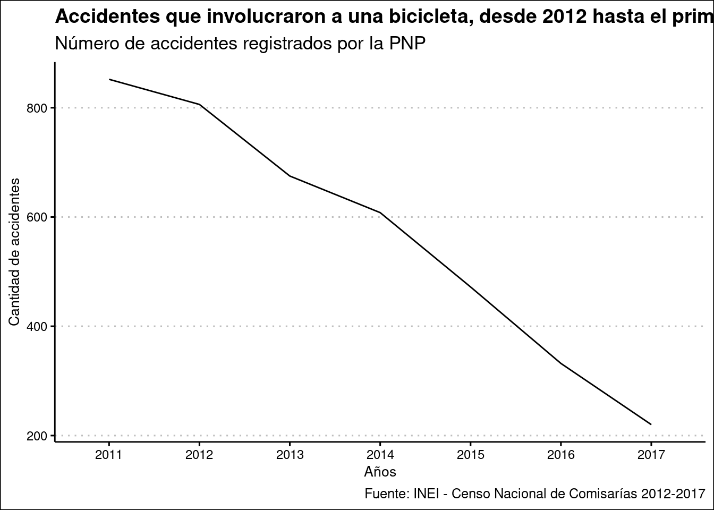
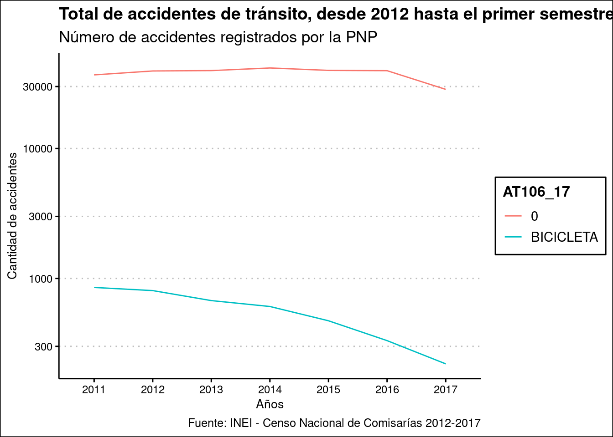

# Trabajo de Sandra

## Bases de datos a usar


```r
library(readxl)
library(dplyr)
```

```
## 
## Attaching package: 'dplyr'
```

```
## The following objects are masked from 'package:stats':
## 
##     filter, lag
```

```
## The following objects are masked from 'package:base':
## 
##     intersect, setdiff, setequal, union
```

```r
library(ggplot2)
library(ggthemes)
library(haven)
```

## A continuación, se han seleccionado solamente las variables relevantes. 

## Modificación del nombre de una variable:

En algunos casos, como en la base del año 2012, la variable AT106_17 tenía otro nombre, por un tema de variables adicionales que se incluyeron ese año en la encuesta y que, por ende, cambiaron la numeración secuencial. Es necesario renombrar la variable para poder cruzarla con los demás años. 


```r
base2012 <- read_sav("data/2012_05_CENACOM02_CAP100.sav")

base2012 <- base2012 %>%
  select(UBIGEO, AT103_A, AT105, AT106_15, AT106_15_CANT, AT108, AT108_1, AT108_2, AT108_3)

base2012 <- base2012 %>%
  rename(
    AT106_17 = AT106_15,
    AT106_17_CANT = AT106_15_CANT
  )
```


```r
base2013 <- read_sav("data/2013_04_ATCapitulo100.sav")

base2013 <- base2013 %>%
  select(UBIGEO, AT103_A, AT105, AT106_17, AT106_17_CANT, AT108, AT108_1, AT108_2, AT108_3)
```


```r
base2014 <- read_sav("data/2014_04_AT_CAP100.SAV")

base2014 <- base2014 %>%
  select(UBIGEO, AT103_A, AT105, AT106_17, AT106_17_CANT, AT108, AT108_1, AT108_2, AT108_3 )
```


```r
base2015 <- read_sav("data/2015_05_AT_Capitulo_100.sav")

base2015 <- base2015 %>%
select(UBIGEO, AT103_A, AT105, AT106_17, AT106_17_CANT, AT108, AT108_1, AT108_2, AT108_3 )

base2015 <- base2015 %>%
  mutate(AT103_A = as.character(AT103_A))
```

## Modificación del nombre de una variable:

En algunos casos, como en la base del año 2016, la variable AT106_17 tenía otro nombre, por un tema de variables adicionales que se incluyeron ese año en la encuesta y que, por ende, cambiaron la numeración secuencial. Es necesario renombrar la variable para poder cruzarla con los demás años.  


```r
base2016 <- read_sav("data/2016_A_T_Capitulo 100.sav")

base2016 <- base2016 %>%
  select(UBIGEO, AT103_A, AT105, AT106_16, AT106_16_CANT, AT108, AT108_1, AT108_2, AT108_3 )

base2016 <- base2016 %>%
  rename(
    AT106_17 = AT106_16,
    AT106_17_CANT = AT106_16_CANT
  )
```

## Modificación del nombre de una variable:

En algunos casos, como en la base del año 2017, la variable AT106_17 tenía otro nombre, por un tema de variables adicionales que se incluyeron ese año en la encuesta y que, por ende, cambiaron la numeración secuencial. Es necesario renombrar la variable para poder cruzarla con los demás años.  


```r
base2017 <- read_sav("data/2017_A_T_Capitulo 100.sav")

base2017 <- base2017 %>%
  select(UBIGEO, AT103_A, AT105, AT106_16, AT106_16_CANT, AT108, AT108_1, AT108_2, AT108_3 )

base2017 <- base2017 %>%
  rename(
    AT106_17 = AT106_16,
    AT106_17_CANT = AT106_16_CANT
  )
```

## Creación de la base general 2012-2017


```r
basegeneral <- bind_rows(
 base2012,
 base2013,
 base2014,
 base2015,
 base2016,
 base2017
)
```

## Conversión de las columnas "labelled" a "factor"


```r
basegeneral <- as_factor(basegeneral)
```


```r
head(basegeneral,20)
```

```
## # A tibble: 20 x 9
##    UBIGEO AT103_A AT105   AT106_17 AT106_17_CANT AT108   AT108_1 AT108_2 AT108_3
##    <chr>  <chr>   <fct>   <fct>            <dbl> <fct>     <dbl>   <dbl>   <dbl>
##  1 100601 2011    Atrope… 0                   NA No fat…      NA       1       1
##  2 100601 2011    Colisi… 0                   NA No fat…      NA       1       1
##  3 100601 2011    Colisi… 0                   NA No fat…      NA       1       1
##  4 100601 2011    Colisi… 0                   NA No fat…      NA       2       1
##  5 100601 2011    Colisi… 0                   NA Solo d…      NA      NA       2
##  6 100601 2011    Colisi… 0                   NA No fat…      NA       2       1
##  7 100601 2011    Colisi… 0                   NA No fat…      NA       2       1
##  8 100601 2011    Colisi… 0                   NA No fat…      NA       1       1
##  9 100601 2011    Atrope… 0                   NA No fat…      NA       1       1
## 10 100601 2011    Colisi… 0                   NA No fat…      NA       1       1
## 11 100601 2011    Colisi… 0                   NA No fat…      NA       1       1
## 12 100601 2011    Atrope… 0                   NA No fat…      NA       1       1
## 13 100601 2011    Colisi… 0                   NA No fat…      NA       4       0
## 14 100601 2011    Atrope… 0                   NA No fat…      NA       1       1
## 15 100601 2011    Colisi… 0                   NA Solo d…      NA      NA       2
## 16 100601 2011    Colisi… 0                   NA Solo d…      NA      NA       2
## 17 100601 2011    Choque  0                   NA Solo d…      NA      NA       1
## 18 100601 2011    Caída … 0                   NA No fat…      NA       1       1
## 19 100601 2011    Colisi… 0                   NA No fat…      NA       2       2
## 20 100601 2011    Despis… 0                   NA Solo d…      NA      NA       1
```

## Total de accidentes registrados por la PNP, desde 2012 al primer semestre del 2017

<!-- Este código será necesario cambiarlo. Jamás debes terminar un encadenamiento (%>%) con un llamado a print(). Los llamados a print() no se hacen en la misma operación en la que creas un objeto. Fíjate que pasa si dejas de usar group_by() en este bloque. -->


```r
accidentesgeneral <- basegeneral %>%
  count(AT103_A) %>%
  group_by(AT103_A) 
```

## Total de accidentes que involucraron una bicicleta, desde 2012 al primer semestre del 2017

<!-- idem -->


```r
accidentesbici <- basegeneral %>%
  filter(AT106_17 == "BICICLETA") %>%
  count(AT103_A, AT106_17)%>%
  group_by(AT103_A) 
```

## Gráfico del total de accidentes de tránsito que involucraron a una bicicleta, desde 2012 hasta el primer semestre de 2017


<!-- accidentesbici ya contenía los resultados  que necesitabas para el gráfico. No era necesario volver a usar la operacion con la que fue creado -->

<!-- Si el único valor presente en AT106_17 será "BICICLETA", ya no necesitas mapear el color a esa variable. -->


```r
accidentesbici <- accidentesbici %>%
  ggplot(aes(AT103_A,
             n,
             group = AT106_17)) +
  geom_line()

accidentesbici +
  theme_clean() +
  labs(
    title = "Accidentes que involucraron a una bicicleta, desde 2012 hasta el primer semestre de 2017",
    subtitle = "Número de accidentes registrados por la PNP",
    caption = "Fuente: INEI - Censo Nacional de Comisarías 2012-2017",
    x = "Años",
    y = "Cantidad de accidentes"
  )
```



## Gráfico del total de accidentes de tránsito, desde 2012 hasta el primer semestre de 2017

<!-- ojo: este código no genera bicicleta vs total. está generando bicicleta vs no bicicleta.
Si quieres bicicleta vs total deberías juntar con bind_rows() tu primer accidentes general con accidentesbici-->

<!-- nuevamente, revisa qué pasa si no usas group_by() aquí -->

<!-- puedes usar una escala especial para el eje Y si quieres comparar líneas con diferencias muy extremas. aquí agregué scale_y_log10() a tu gráfico para pedirle que Y use una escala logarítimica de base 10. Esto tienes que dejarlo bien claro en la explicación de tu código y del gráfico porque puede prestar a confusión. -->


```r
accidentesgeneral <- basegeneral %>%
  count(AT103_A, AT106_17) %>%
  group_by(AT103_A) %>%
    ggplot(aes(AT103_A,
                n,
               color = AT106_17, 
               group = AT106_17)) +
  geom_line()

accidentesgeneral +
  scale_y_log10()+
  theme_clean() +
  labs(
    title = "Total de accidentes de tránsito, desde 2012 hasta el primer semestre de 2017",
    subtitle = "Número de accidentes registrados por la PNP",
    caption = "Fuente: INEI - Censo Nacional de Comisarías 2012-2017",
    x = "Años",
    y = "Cantidad de accidentes"
  )
```


